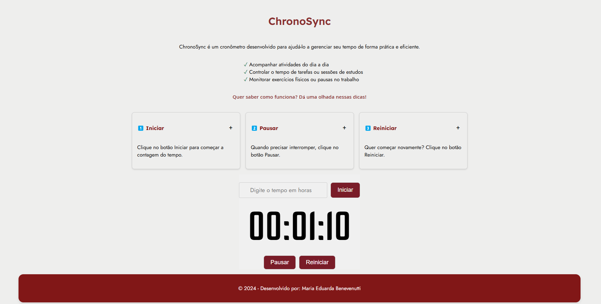

# ChronoSync ⏲️  

## 📖 Descrição  
**ChronoSync** é uma aplicação simples e elegante que implementa um cronômetro utilizando React. Ideal para acompanhar atividades em equipe, produtividade pessoal ou qualquer tarefa que necessite de controle de tempo.  

## 🚀 Tecnologias Utilizadas  
- **React**: Biblioteca JavaScript para construir a interface do usuário.  
- **CSS3**: Para estilização e layout responsivo.   
- **React Hooks (useState, useEffect)**: Para gerenciar estado e ciclos de vida do componente.  

## 🎯 Funcionalidades  
- **Iniciar/Parar o cronômetro**  
- **Reiniciar o cronômetro**  
- **Design responsivo e moderno**  
- **Exibição em tempo real (HH:MM:SS)**  

## 🖼️ Prévia  
  

## 🛠️ Como Executar o Projeto  

### Pré-requisitos  
- **Node.js** instalado (versão 14 ou superior).  
- **npm** como gerenciador de pacotes.  

### Passo a passo  
1. **Clone o repositório**  
   ```bash  
   git clone https://github.com/eduardabenevenutti77/ChronoSync.git  
   cd ChronoSync  
   ```  

2. **Instale as dependências**  
   ```bash  
   npm install  
   ```  

3. **Inicie o servidor de desenvolvimento**  
   ```bash  
   npm run dev
   ```  

4. **Acesse no navegador**  
   O projeto estará disponível em [http://localhost:5173](http://localhost:5173).  

## 📂 Estrutura do Projeto  
```
chronoSync/   
├── src/  
│   ├── components/  
│   │   └── cards/
|   |       ├── cards.jsx
|   |       └──style-cards.css
|   |   └── countTime/
|   |       ├── countTime.jsx
|   |       └── style-count.css
|   |   └── footer/
|   |       ├── footer.jsx
|   |       └── style-footer.css
|   ├── pages/
|   |   └── time/
|   |       ├── style-time.css
|   |       └── time.jsx
│   ├── App.js  
│   ├── index.js  
│   └── styles.css  
├── package.json  
└── README.md  
```  

## 🔧 Possíveis Melhorias  
- Incluir uma lista de tempos salvos (laps).  
- Temas personalizáveis (modo claro/escuro).  
- Integração com armazenamento local para salvar estado.  

## 🤝 Contribuindo  
Contribuições são sempre bem-vindas! Sinta-se à vontade para abrir issues e pull requests no repositório.  

## 💬 Contato  
Para dúvidas ou sugestões:  
📧 Email: [mariaeduardabenevenutti77@gmail.com](mailto:mariaeduardabenevenutti77@gmail.com)  
🔗 GitHub: [github.com/eduardabenevenutti77](https://github.com/eduardabenevenutti77)  

---